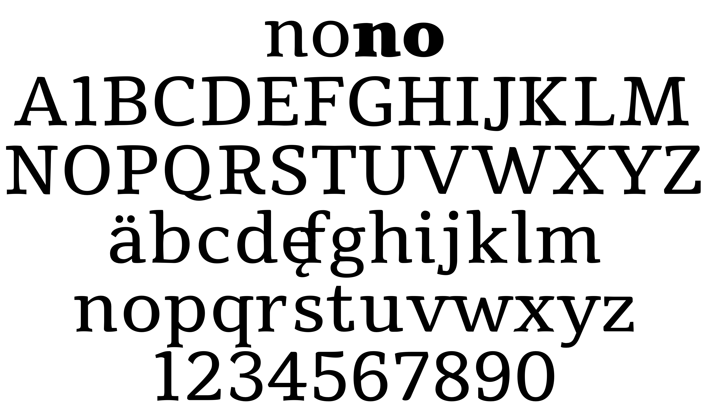

# Tienne
By Vernon Adams

Tienne is a display and text serif webfont designed to be used freely across the internet by web browsers on desktop computers, laptops and mobile devices.

It was designed by 'remixing' Droid Serif and Artifika, two other fonts in the Google Font Directory that are available under the SIL Open Font License which allows for remixing fonts with interpolation techniques.

## License

Licensed under the [SIL Open Font License, 1.1](http://scripts.sil.org/OFL); you may only use these files in compliance with the License.

To contribute to the project, file an issue at https://github.com/googlefonts/Tienne2Font